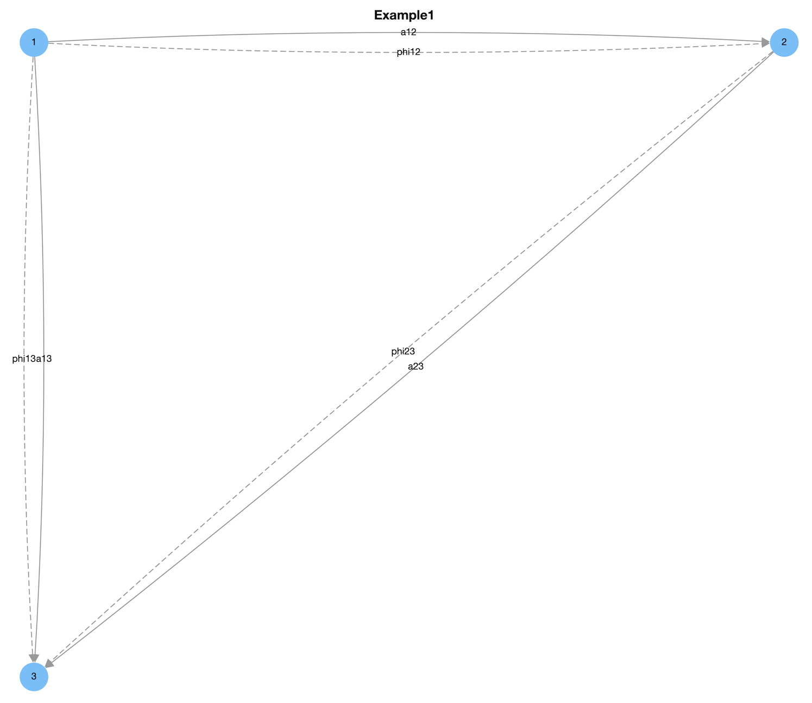
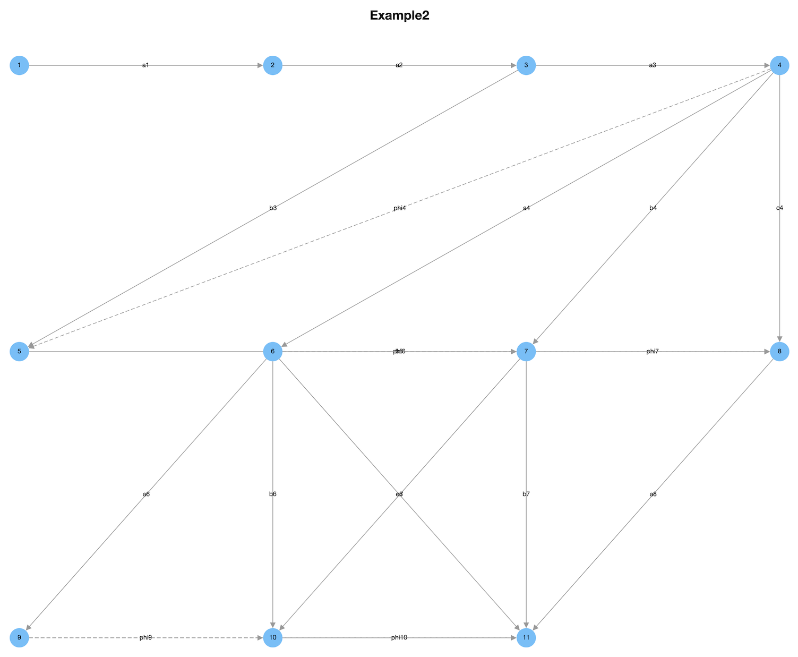

# Bocses  
A [Magma](http://magma.maths.usyd.edu.au) software package for computing with [bocses](https://arxiv.org/abs/1601.03899).  

By [Julian Külshammer](https://julian-kuelshammer.github.io/) and [Ulrich Thiel](https://ulthiel.com/math), 2017

## Prerequisites
You need [Magma](http://magma.maths.usyd.edu.au) version at least 2.19. 

## Downloading and running
You can download the latest version as a zip archive [here](https://github.com/ulthiel/Bocses/archive/refs/heads/master.zip). Then just run ```./Bocses.sh```. 

Alternatively, from within a Magma session, run ```AttachSpec("Bocses.s.m");```.

## Usage

We illustrate the use of this software with two examples.

### Example 1

We want to create the following bocs and its reduction:



```c++
//First, create the underlying quiver of the bocs.
//Edge labels are passed as list at the beginning in
//the same order as the successive list of tuples defining
//the edges. The edge labels can be used to define the
//differentials later.
B<a12,a23,a13,phi12,phi23,phi13>:=Bocs([1,2,3], \
[<1,2>,<2,3>, <1,3>,<1,2>,<2,3>,<1,3>] : Title:="Example1"); 

//Set non-zero edge degrees
B`EdgeDegrees["phi12"] :=1;
B`EdgeDegrees["phi23"] :=1;
B`EdgeDegrees["phi13"] :=1;

//Set non-zero edge levels
B`EdgeLevels["phi13"] :=2;
B`EdgeLevels["a13"] :=2;

//Set non-zero edge differentials
B`EdgeDifferentials["a13"]:=phi23*a12;

//Draw the bocs.
//This creates an HTML file in the directory "Output/Example 1"
//which is opened automatically. It contains an interactive graph
//like above.
Draw(B);

//Do reduction
Bred := Reduction(B);

//draw without adding edge labels
Draw(Bred : EdgeLabels:=false);

//Silently draw each reduction step and put in 
//output directory.
Bred := Reduction(B : DrawAll:=true);
```

The ```Draw``` command will create and open an HTML file in the ```Output``` directory containing the bocs as an interactive graph (vertices and edges can be moved with the mouse). The reduction of the bocs above looks as follows:


## Example 2

In this example we do a reduction of the following bocs at a specific dimension vector:



 The result is a whole list of bocses, each bocs representing one step in the reduction process.

```c++
B<a1,a2,a3,a4,a6,a5,a7,a8,b3,b4,b6,b5,b7,c4,c6,phi4,phi6,phi7,\
phi9,phi10,psi6,psi9> := Bocs([1,2,3,4,5,6,7,8,9,10,11],\
[<1,2>,<2,3>,<3,4>,<4,6>,<6,9>,<5,7>,<7,10>,<8,11>,<3,5>,\
<4,7>,<6,10>,<5,8>,<7,11>,<4,8>,<6,11>,<4,5>,<6,7>,<7,8>,\
<9,10>,<10,11>,<6,8>,<9,11>] : Title:="Example2");

B`EdgeDegrees["phi4"] := 1;
B`EdgeDegrees["phi6"] := 1;
B`EdgeDegrees["phi9"] := 1;
B`EdgeDegrees["phi7"] := 1;
B`EdgeDegrees["phi10"] := 1;
B`EdgeDegrees["psi6"] := 1;
B`EdgeDegrees["psi9"] := 1;
B`EdgeDegrees["phi10"] := 1;

B`EdgeLevels["b3"] := 2;
B`EdgeLevels["b4"] := 2;
B`EdgeLevels["b6"] := 2;
B`EdgeLevels["b5"] := 2;
B`EdgeLevels["b7"] := 2;
B`EdgeLevels["psi6"] := 2;
B`EdgeLevels["psi9"] := 2;
B`EdgeLevels["c4"] := 3;
B`EdgeLevels["c6"] := 3;

B`EdgeDifferentials["b3"] := phi4*a3;
B`EdgeDifferentials["b4"] := phi6*a4-a5*phi4;
B`EdgeDifferentials["b6"] := phi9*a6-a7*phi6;
B`EdgeDifferentials["b5"] := phi7*a5;
B`EdgeDifferentials["b7"] := phi10*a7-a8*phi7;
B`EdgeDifferentials["c4"] := phi7*b4-b5*phi4+psi6*a4;
B`EdgeDifferentials["c6"] := phi10*b6-b7*phi6+psi9*a6-a8*psi6;
B`EdgeDifferentials["psi6"] := phi7*phi6;
B`EdgeDifferentials["psi9"] := phi10*phi9;

Bred := Reduction(B, [ 1, 0, 0, 1, 0, 1, 1, 1, 0, 0, 1 ]);
```
